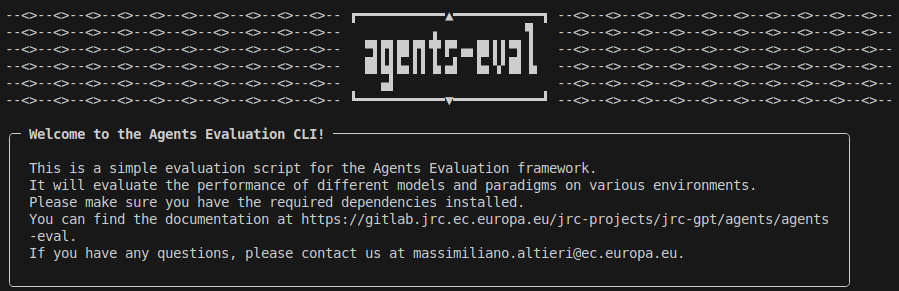
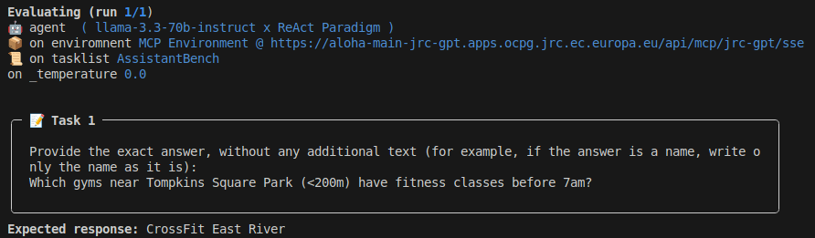

# PALACE


A framework to evaluate the agentic capabilities of LLMs.


## Description

**PALACE** is a **P**latform for **A**utomated **L**LMs **A**gentic **C**apabilities **E**valuation.
It can quantitatively assess the performance of AI agents across several different benchmarks.
It works both for locally-defined and executed agents as well as remote agents deployed via MCP.
The benchmark tasklists evaluate the capability of the agents in tasks requiring the use of tools, mainly web browsing, to gather the required information, as well as reason with that information to reach the user objective.
The framework allows to easily add new tasklists from HuggingFace and align them to the same format.

The framework is composed of two main parts: the evaluation part and agent engine part. Over time, the agent engine part is being detached from this project, which will focus exclusively on evaluation.
If you are interested in agent definition, you may be interested in the [ABW](https://gitlab.jrc.ec.europa.eu/jrc-projects/jrc-gpt/research/agents-by-workflow) project.

In PALACE, the output of an evaluation run is a JSONL file containing all the collected information. This information can be used to build user-friendly results visualizations.

## Installation

**PALACE** is provided as a Python package. It can be downloaded and installed normally (it may be released on PyPI in the future).

Here are the steps:

1. **Clone the project:**
   ```bash
   git clone https://gitlab.jrc.ec.europa.eu/jrc-projects/jrc-gpt/evaluation/palace-lib.git palace
   cd palace
   ```

2. **Install uv** (if not already installed):
   ```bash
   curl -LsSf https://astral.sh/uv/install.sh | sh
   ```

3. **Install dependencies** (uv will automatically create a virtual environment):
   ```bash
   uv sync
   ```

4. **Configure secrets and other variables:**

   4.1. Open file `.env.example` and **set** all relevant information.

   4.2. Then rename the file:
   ```bash
   mv .env.example .env
   ```

That's it! You are ready to use PALACE.

## Quick Start

Here's a complete example to evaluate a model on the SimpleQA benchmark:

```bash
# 1. Download the SimpleQA tasklist (no HuggingFace token required for public datasets)
uv run -- palace-download -t SimpleQA

# 2. Run the evaluation against an OpenAI-compatible endpoint
uv run -- palace-run -u https://api.openai.com/v1 -k $OPENAI_LIKE_API_KEY -m gpt-4o -t SimpleQA -l 20
```

This will evaluate `gpt-4o` on 20 tasks from SimpleQA and save results to `~/.cache/palace/results/`.

## Downloading Tasklists

Before running evaluations, you need to download the benchmark tasklists using `palace-download`.

### Download all tasklists

To download all available tasklists (requires a HuggingFace token for private datasets):

```bash
uv run -- palace-download
```

### Download specific tasklists

To download only specific tasklists:

```bash
uv run -- palace-download -t SimpleQA HotpotQA
```

Public datasets like SimpleQA, HotpotQA, and AssistantBench can be downloaded without a HuggingFace token. Gated datasets (like GAIA) and private PALACE collection datasets require a token.

### Skip existing tasklists

To skip tasklists that are already downloaded:

```bash
uv run -- palace-download --skip-existing
```

### HuggingFace token

For gated or private datasets, set the `HUGGINGFACE_TOKEN` environment variable in your `.env` file. You can get a token from [HuggingFace Settings](https://huggingface.co/settings/tokens).

Tasklists are downloaded to the user data directory:
- Linux: `~/.cache/palace/tasklists/`
- macOS: `~/Library/Caches/palace/tasklists/`
- Windows: `C:\Users\<user>\AppData\Local\palace\Cache\tasklists\`

## Usage

There are a total of **3** supported ways to use PALACE: (1) via the **interactive CLI**, (2) via the **direct command**, or (3) **programmatically**.

*For power-users:* PALACE is built with modularity in mind, so it's also possible to extend the key base classes and achieve additional functionalities. If you intend to do so, you are encouraged to contribute to the project directly and open pull requests!

### CLI

The easiest way to start using PALACE right away is using the global CLI command `palace-cli`.
Simply type it in your terminal:

```bash
uv run -- palace-cli
```

This command should open up the main CLI, and you should be initially be presented with something like this:


Subsequently, you will be prompted with a series of questions where you can configure the evaluation run. Use the up and down arrow keys to navigate the menu options, Space to select options, and Enter to confirm the selection.
These are the current evaluation parameters:

- Location of the agent to evaluate (local, remote via MCP, or remote via OpenAI-compatible API),
- If remote agents is selected,
  - the URL of the MCP server or OpenAI-compatible API where the agent is deployed,
  - the remote agents to evaluate,
- If local agents is selected,
  - the reasoning paradigms to evaluate,
  - the LLMs to evaluate,
  - whether you want to run the LLMs underlying the agents on the local machine (a high-memory GPU is required) or on GPT@JRC,
  - the environments (set of tools) to evaluate, including remote MCP environments,
- The benchmark tasklists to use for the evaluation,
- Number of tasks to evaluate for each tasklist (this is to prevent extremely long testing times),
- Number of runs to perform for each configuration (it can be useful to lower the variance, since it's not deterministic),
- The name for the evaluation run.

After selecting all parameters, the evaluation run will start, and you will see the first configuration being evaluated:


The outputs of the evaluation are saved to `results/<evaluation_name>.jsonl` (in the user data directory, e.g., `~/.cache/palace/results/` on Linux).

### Direct Command

If you want to run batch evaluations, it may be more convenient to use the direct global command (uninteractive) `palace-run`.

For now, the direct command only supports agents and models that are deployed via an OpenAI-compatible API.
Besides that, you pass the same information that you would pass to the CLI.

For an explanation of the command run:
```bash
uv run -- palace-run --help
```

The `-k/--token` parameter can be omitted if you set the `OPENAI_LIKE_API_KEY` environment variable.

As an example, consider the following command:
```bash
uv run -- palace-run \
   --run-name=MyEval \
   --output-folder=/path/to/palace-results \
   --url=https://api.mistral.ai/v1 \
   --token=abc123def456 \
   --name=mistral-medium-latest \
   --tasklist=ValuesEval24 \
   --limit=50
```

Or a shorter example:
```bash
uv run -- palace-run -u https://api.mistral.ai/v1 -k abc123def456 -m mistral-medium-latest -t ValuesEval24 -l 20
```

### Programmatic API

The programmatic API allows you to integrate PALACE as a library dependency into other Python software.

For now, the programmatic API only supports agents and models that are deployed via an OpenAI-compatible API.
Besides that, you pass the same information that you would pass to the CLI.

Using PALACE programmatically is as easy as calling a function:

```python
from palace import evaluate

evaluate(
   run_name="My Evaluation",         # evaluation run name
   output_folder="palace_results",   # folder where to save results (default: ~/.cache/palace/results/)
   url="https://api.mistral.ai/v1",  # your API URL
   token="abc123def456",             # your API token
   name="mistral-medium-latest",     # model or agent name
   tasklist="GAIA",                  # PALACE tasklist to use
   limit=100,                        # optional; useful for very large tasklists
   runs_per_configuration=5,         # optional; useful to smooth out variance
)
```

The outputs of the evaluation are saved to `<output_folder>/<run_name>.jsonl`.

### MCP Server

The package comes with an MCP server that you can use to debug or test the application in case you don't have a ready MCP server to use. The pre-package MCP server only contains a web search tool and a fetch tool.

To start it, simply run the global command:

```bash
uv run -- palace-mcpstart
```

on another terminal and leave it running.

## Tasklists

Benchmark datasets in PALACE have a standard format.
A dataset is internally called _tasklist_, and it mainly consists of a JSON file `tasks.json` containing the actual _tasks_.
Additionally, a tasklist may have a `task_files` folder containing files referenced in the tasks.
The directory structure is the following:

```
<tasklist_name>
├─ task_files
│  ├─ file_1
│  ├─ ...
│  └─ file_n
│  tasks.json
└─ info.json
```

A task is a JSON object containing the following fields (fields with an asterisk are mandatory):

- **(\*) id**: Unique identifier for the task.
- **(\*) objective**: The main goal or prompt for the task.
- **expected**: The expected answer or outcome.
- **references**: Supporting references or information.
- **difficulty**: Difficulty level of the task.
- **document**: Related document.
- **attachment**: Filename or path to an attachment.
- **custom_verificator**: Custom verification logic or script.
- Any task-type-specific fields as defined in `task_type_fields` in `info.json`.

In addition, the `<tasklist_name>/info.json` file contains metadata information about the tasklist.
The `info.json` file is a simple JSON with fields `name`, `id`, `type`, `config`, `split`, `category`, `task_type`, `task_type_fields`.
Most fields have a specific meaning when downloading tasklists from HuggingFace.
For custom datasets, the only really meaningful field is `task_type`.

### Supported tasklists

PALACE comes pre-packaged with a list of vetted tasklists, although new custom tasklists can be easily added.
The list of included tasklists is the following:
- **BABILong-32k**: long-context reasoning over 32k tokens *(from HuggingFace RMT-team/babilong)*
- **BABILong-128k**: long-context reasoning over 128k tokens *(from HuggingFace RMT-team/babilong)*
- **HotpotQA**: multi-hop question answering *(from HuggingFace hotpotqa/hotpot_qa)*
- **SimpleQA**: straightforward questions asking for short, factual answers *(from HuggingFace basicv8vc/SimpleQA)*
- **Fever**: fact-checking *(from HuggingFace fever/fever)* (⚠️ possibly deprecated)
- **CURIE-protein**: protein sequence reconstruction *(from HuggingFace nhop/curie)*
- **HLE**: graduate-level questions across diverse fields *(from HuggingFace cais/hle)*
- **GAIA**: real-world tasks requiring web access *(from HuggingFace gaia-benchmark/GAIA)*
- **AssistantBench**: real-world tasks requiring web access *(from HuggingFace AssistantBench/AssistantBench)*
- **Sycophancy-Binary**: A-B sycophancy quiz *(custom dataset)*
- **Sycophancy-OpenEnded**: open-ended sycophancy quiz *(custom dataset)*
- **DeepConsult**: report generation *(custom dataset)*
- **DocRetrieval-multi**: questions spanning multiple documents *(custom dataset)*

### Adding a custom tasklist

To add a custom tasklist, create files in the user data directory (e.g., `~/.cache/palace/tasklists/` on Linux):

- `<tasklist_name>/tasks.json` — list of tasks in the above-mentioned format
- `<tasklist_name>/info.json` — tasklist metadata in the above-mentioned format
- optionally, `<tasklist_name>/task_files/` — folder containing files referenced in the `reference` field of the tasks

Your custom tasklist will be automatically available to be used for evaluation in PALACE.

## FAQ

- **"I want to evaluate my model / agent that I have locally with PALACE."**

   You can either (i) deploy it on GPT@JRC and evaluate it from there, or (ii) deploy it locally, clone PALACE, install it, and evaluate it.

- **"But I want the online PALACE instance (Gradin) to do it, and save the results to Vault."**

   Deploy the model on GPT@JRC and it will be evaluated automatically, or tell me and I will go to the admin Gradin page and manually set your OpenAI endpoint (it must be public).

- **"My endpoint is local. How can I save scores to Vault?"**

   Install PALACE locally and run it. We will manually add your model and your scores to Vault.

## Support

If you have any issues, you can open an issue on the [GitLab repository](https://gitlab.jrc.ec.europa.eu/jrc-projects/jrc-gpt/evaluation/palace-lib), or you can contact me at massimiliano.altieri@ec.europa.eu.
