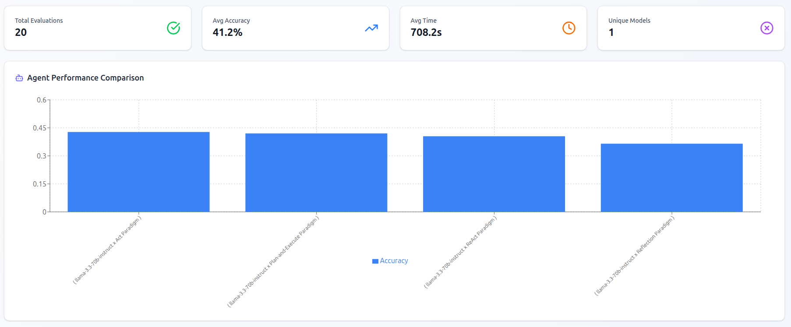
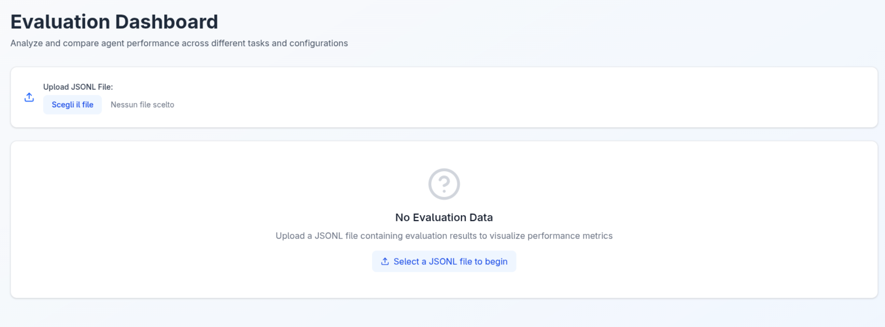

# PALACE


A framework to evaluate the agentic capabilities of LLMs.


## Description

**PALACE** is a **P**latform for **A**utomated **L**LMs **A**gentic **C**apabilities **E**valuation.
It can quantitatively assess the performance of AI agents across several different benchmarks.
It works both for locally-defined and executed agents as well as remote agents deployed via MCP.
The benchmark tasklists evaluate the capability of the agents in tasks requiring the use of tools, mainly web browsing, to gather the required information, as well as reason with that information to reach the user objective.
The framework allows to easily add new tasklists from HuggingFace and align them to the same format.

The framework is composed of two main parts: the evaluation part and agent engine part. Over time, the agent engine part is being detached from this project, which will focus exclusively on evaluation.
If you are interested in agent definition, you may be interested in the [ABW](https://gitlab.jrc.ec.europa.eu/jrc-projects/jrc-gpt/agents-by-workflow) project.

In PALACE, the output of an evaluation run is a JSONL file containing all the collected information. This information can be used to build user-friendly results visualizations. An interactive web dashboard is available within this repository to get insights about the results.



## Installation

**PALACE** is provided as a Python package. It can be downloaded and installed normally (it may be released on PyPI in the future).

Here are the steps:

1. **Clone the project:**

```bash
$ git clone https://gitlab.jrc.ec.europa.eu/jrc-projects/jrc-gpt/agents/agents-eval.git palace
```

2. _(Optional, but recommended)_ **Create a virtual environment:**

```bash
$ conda create -n palace python=3.13.*
$ conda activate palace
```

3. **Install** (this will also install all required dependencies):

```bash
$ python3 -m pip install palace
```

4. **Configure secrets and other variables:**

   4.1. Open file `palace/.configure.env` and **set** all relevant information.

   4.2. Then,

```bash
$ mv palace/.configure.env palace/.env
```

4. _(Optional)_ **Download the included benchmark tasklists:**

```bash
$ python3 -m palace.data_utils.download
```

That's it! You are ready to use PALACE.

## Usage

### CLI

The main entry point of this package is the global CLI command `palace-run`. Simply type it in your terminal (be sure to activate the Python environment where the package is installed):

```bash
$ palace-run
```

This command should open up the main CLI, and you should be initially be presented with something like this:


Subsequently, you will be prompted with a series of questions where you can configure the evaluation run. Use the up and down arrow keys to navigate the menu options, Space to select options, and Enter to confirm the selection.
These are the current evaluation parameters:

- Location of the agent to evaluate (local, remote via MCP, or remote via OpenAI-compatible API),
- If remote agents is selected,
  - the URL of the MCP server or OpenAI-compatible API where the agent is deployed,
  - the remote agents to evaluate,
- If local agents is selected,
  - the reasoning paradigms to evaluate,
  - the LLMs to evaluate,
  - whether you want to run the LLMs underlying the agents on the local machine (a high-memory GPU is required) or on GPT@JRC,
  - the environments (set of tools) to evaluate, including remote MCP environments,
- The benchmark tasklists to use for the evaluation,
- Number of tasks to evaluate for each tasklist (this is to prevent extremely long testing times),
- Number of runs to perform for each configuration (it can be useful to lower the variance, since it's not deterministic),
- The name for the evaluation run.

After selecting all parameters, the evaluation run will start, and you will see the first configuration being evaluated:


The outputs of the evaluation are saved to `results/<evaluation_name>.jsonl`.

### Dashboard

Once you have results, you can visualize them in a user-friendly way with the integrated web dashboard.
To do that, move to the `palace/src/dashboard/` folder, then run

```bash
$ npm install
npm run dev
```

The dashboard will be live at `http://localhost:5173`, where you can upload the evaluation results files (JSONL) and get nice visualizations.



### MCP Server

The package comes with an MCP server that you can use to debug or test the application in case you don't have a ready MCP server to use. The pre-package MCP server only contains a web search tool and a fetch tool.

To start it, simply run the global command:

```bash
$ palace-mcpstart
```

on another terminal and leave it running.

## Tasklists

Benchmark datasets in PALACE have a standard format.
A dataset is internally called _tasklist_, and it mainly consists of a JSON file `tasks.json` containing the actual _tasks_.
Additionally, a tasklist may have a `task_files` folder containing files referenced in the tasks.
The directory structure is the following:

```
<tasklist_name>
├─ task_files
│  ├─ file_1
│  ├─ ...
│  └─ file_n
└─ tasks.json
```

A task is a JSON object containing the following fields (fields with an asterisk are mandatory):

- **(\*) id**: Unique identifier for the task.
- **(\*) objective**: The main goal or prompt for the task.
- **expected**: The expected answer or outcome.
- **references**: Supporting references or information.
- **difficulty**: Difficulty level of the task.
- **document**: Related document.
- **attachment**: Filename or path to an attachment.
- **custom_verificator**: Custom verification logic or script.

In addition, the `tasklists/metadata` folder in the project root contains metadata information about tasklists.
The directory structure for metadata is the following:

```
metadata
└─ <tasklist_name>
   └─ info.json
```

The `info.json` file is a simple JSON with fields `name`, `id`, `type`, `config`, `split`, `category`.
Most fields have a specific meaning when downloading tasklists from HuggingFace.
For custom datasets, the only really meaningful field is `category`.

### Adding a custom tasklist

To add a custom tasklist, create:

- a new file `tasklists/custom/<tasklist_name>/tasks.json`, containing a list of tasks, in the above-mentioned task format;
- a new file `tasklists/metadata/<tasklist_name>/info.json`, containing tasklist metadata in the above-mentioned format;
- optionally, a new folder `tasklists/custom/<tasklist_name>/task_files`, containing files referenced in the `reference` field of the tasks.

Your custom tasklist will be automatically available to be used for evaluation in PALACE.

## Containers (experimental)

_(This section is experimental and not advised.)_

You can build and run the images in the `images` folder as containers.

For example, to build the MCP server image, `cd` into the project root and run:

```bash
$ docker build -t mcp-server:latest -f images/mcp-server/Dockerfile .
```

And then,

```bash
$ docker run -d -p 8080:8080 mcp-server:latest
```

The MCP server will be ready to serve requests on port 8080.

## Support

If you have any issues, you can open an issue on the [GitLab repository](https://gitlab.jrc.ec.europa.eu/jrc-projects/jrc-gpt/agents/agents-eval), or you can contact me at massimiliano.altieri@ec.europa.eu.
