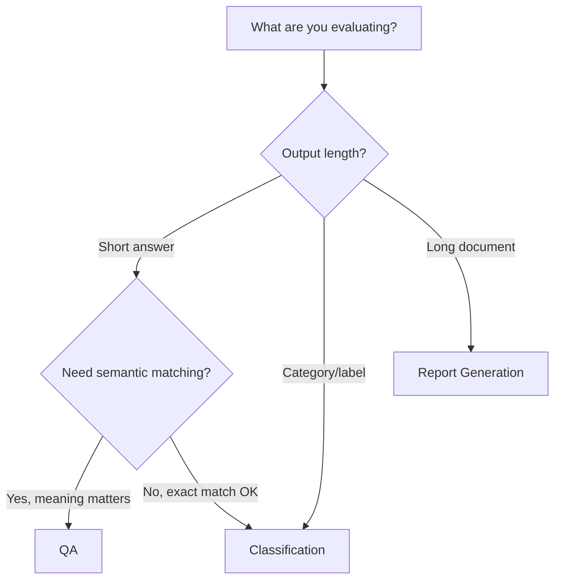

# Task Types

PALACE supports three task types, each designed for different evaluation scenarios. Choosing the right one depends on what you're measuring and how you want to verify correctness.

## Overview

Every PALACE benchmark uses exactly one task type, specified in `info.json`. The task type determines:

- How the model's prompt is constructed
- What output format is expected
- How correctness is verified

Understanding the differences helps you choose the right approach for your evaluation goals.

## The Three Task Types

### QA (Question-Answering)

QA evaluates whether a model's response is semantically correct compared to reference answers. An LLM judge assesses whether the meaning is equivalent, allowing for different phrasings and varied sentence structures.

**Best for**: Factual questions, reading comprehension, any task where the substance matters more than exact wording.

**Verification**: LLM judge evaluates semantic equivalence (or custom criterion).

**Example use cases**:
- Knowledge QA ("What is the capital of France?")
- Reading comprehension with open-ended answers
- Claim verification where phrasing varies
- Sycophancy detection with custom criteria

[Learn more about QA →](qa.md)

### Classification

Classification evaluates whether a model can correctly categorize content into predefined labels. The model outputs labels in XML format, and PALACE compares them exactly against expected values.

**Best for**: Safety classifiers, content moderation, sentiment analysis, any task with categorical outputs.

**Verification**: Exact string match (no LLM judge needed).

**Example use cases**:
- Safety classification ("Is this content harmful?")
- Sentiment analysis (Positive/Negative/Neutral)
- Content moderation with multiple categories
- Binary decisions (Yes/No, A/B)

[Learn more about Classification →](classification.md)

### Report Generation

Report Generation evaluates long-form content through pairwise comparison. An LLM judge compares the model's output against a reference document across multiple weighted criteria.

**Best for**: Research reports, summaries, technical documents, any long-form content where multiple quality dimensions matter.

**Verification**: LLM judge performs pairwise comparison with configurable criteria.

**Example use cases**:
- Research report quality assessment
- Executive summary evaluation
- Technical documentation review
- Multi-dimensional content scoring

[Learn more about Report Generation →](report-generation.md)

## Choosing a Task Type



### Decision Guide

**Choose QA when:**

- Answers can be phrased differently but mean the same thing
- You need semantic equivalence checking
- You have reference answers to compare against
- You want to define custom evaluation criteria (e.g., "belief independence")
- The distinction between correct and incorrect is nuanced

**Choose Classification when:**

- Output must be one of a predefined set of labels
- Exact match is appropriate and sufficient
- You need fast verification without API calls
- You're building safety filters or content classifiers
- Reproducibility and determinism matter

**Choose Report Generation when:**

- Evaluating long-form written content
- Multiple quality dimensions matter (accuracy, completeness, style)
- You have reference documents for comparison
- You want weighted scoring across criteria
- Content quality is multifaceted

## Quick Comparison

| Aspect | QA | Classification | Report Generation |
|--------|----|-----------------|--------------------|
| **Output type** | Short/medium text | Categorical labels | Long-form documents |
| **Verification** | LLM judge | Exact match | LLM judge (pairwise) |
| **Speed** | Slower (API calls) | Fast (no API) | Slower (API calls) |
| **Flexibility** | High (semantic) | Low (exact) | High (multi-criteria) |
| **Configuration** | Criterion, references | Labels, classes | Criteria, weights |

## Common Mistakes

### Using Classification When QA is Better

❌ **Problem**: You want to check if an answer is factually correct, but there are many valid phrasings.

```json
// This won't work well - too many valid answers
{"labels": [{"name": "Answer", "classes": [
    {"name": "Paris", "condition": "..."},
    {"name": "The capital is Paris", "condition": "..."},
    {"name": "Paris is the capital", "condition": "..."}
]}]}
```

✅ **Solution**: Use QA with semantic equivalence.

```json
{"task_type": "QA"}
// tasks.json: {"expected": "Paris"}
// Judge will accept "Paris", "The capital is Paris", etc.
```

### Using QA When Classification is Better

❌ **Problem**: You have a fixed set of valid outputs and need exact matching.

```json
// Overkill - LLM judge for simple Yes/No
{"task_type": "QA"}
// tasks.json: {"expected": "Yes"}
```

✅ **Solution**: Use Classification for deterministic verification.

```json
{"task_type": "Classification", "task_type_fields": {"labels": [
    {"name": "Harmful", "classes": [
        {"name": "Yes", "condition": "if harmful"},
        {"name": "No", "condition": "if safe"}
    ]}
]}}
```

### Using QA for Long-Form Content

❌ **Problem**: You're evaluating research reports with a single "correct/incorrect" judgment.

```json
{"task_type": "QA"}
// Loses nuance - reports are complex
```

✅ **Solution**: Use Report Generation with multiple criteria.

```json
{"task_type": "Report Generation", "task_type_fields": {"criteria": [
    {"name": "accuracy", "description": "...", "weight": 2.0},
    {"name": "completeness", "description": "...", "weight": 1.0},
    {"name": "clarity", "description": "...", "weight": 1.0}
]}}
```

## Configuration Summary

Each task type has its own configuration in `task_type_fields`:

### QA Configuration

```json
{
    "task_type": "QA",
    "task_type_fields": {
        "correctness_criterion": {
            "name": "semantic equivalence",
            "description": "The answer conveys the same factual meaning."
        },
        "references": {
            "correct": ["expected"],
            "incorrect": []
        }
    }
}
```

### Classification Configuration

```json
{
    "task_type": "Classification",
    "task_type_fields": {
        "labels": [
            {
                "name": "LabelName",
                "description": "What this label measures.",
                "classes": [
                    {"name": "Value1", "condition": "when to use this"},
                    {"name": "Value2", "condition": "when to use this"}
                ]
            }
        ]
    }
}
```

### Report Generation Configuration

```json
{
    "task_type": "Report Generation",
    "task_type_fields": {
        "criteria": [
            {"name": "criterion_name", "description": "...", "weight": 1.0}
        ]
    }
}
```

See each task type's documentation for complete configuration options.

---

## Next Steps

- [QA Task Type](qa.md) - Semantic verification with LLM judges
- [Classification Task Type](classification.md) - Exact-match categorical outputs
- [Report Generation Task Type](report-generation.md) - Pairwise document comparison
- [Task Type Fields Reference](../reference/task-type-fields.md) - Complete field specifications
